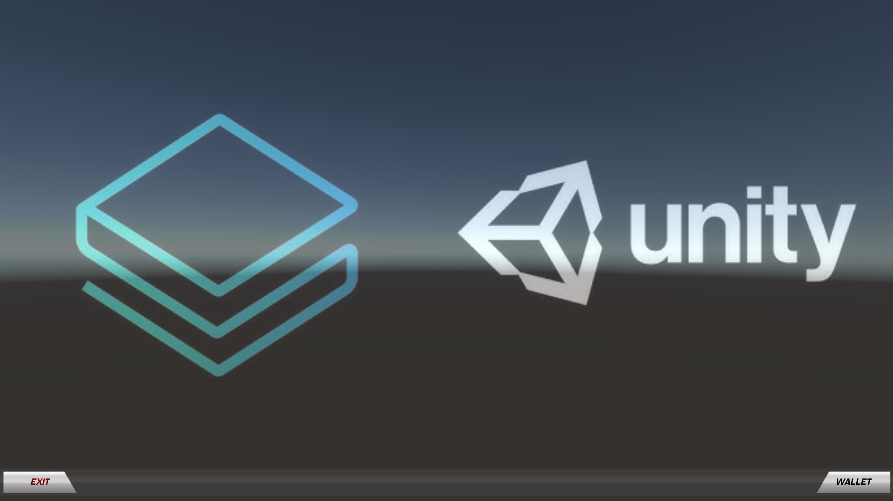
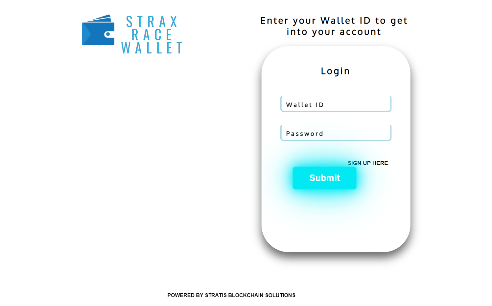
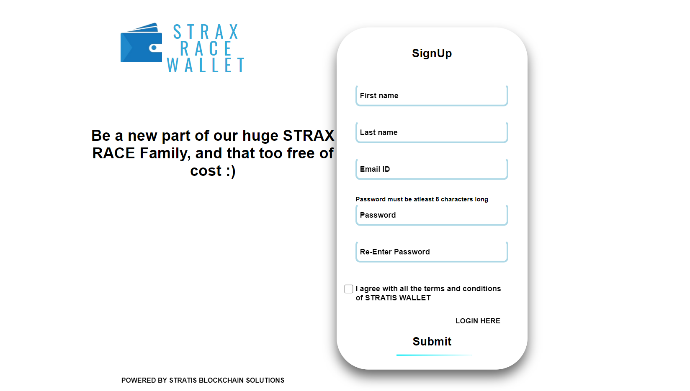
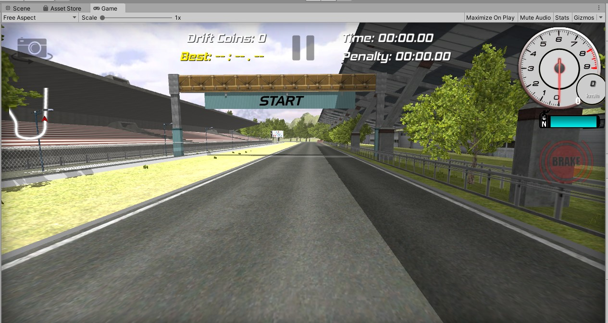
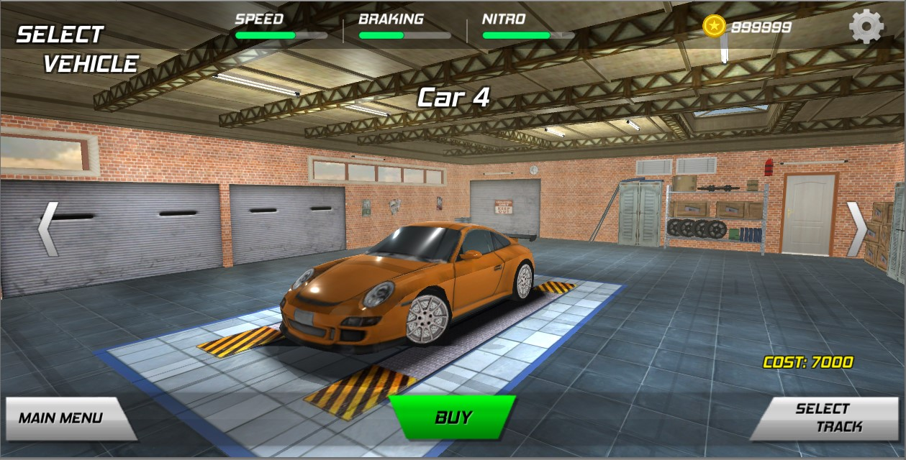

# STRAX Race

STRAX Race as the name suggests is a Car racing game, where you can win real STRAX.


## Inspiration
We are a group of unity and python developers. We wanted to integrate both the technologies to come up with something that has real-world usage, and which can be taken forward. So we decided to create a racing car game with a web-based digital wallet using PyStratis.

## What it does
It's a racing car game, in which you need to pay small fees of 1 Strax to start the game. To pay the amount you will be directed to the web-based wallet. Once the fee is paid you will be redirected to play the game. Once the game end, if you win you will be credited 2 Strax in the wallet

## Installation

Install STRAX Race with git :
```bash
  git clone https://github.com/kampy15/STRAX-Race
```
After completion of cloning run the following commands one by one :
```bash
cd STRAX-Race
pip install -r requirements.txt
```
Now you have to clone the Stratis Fullnode into your system:
```bash
git clone https://github.com/stratisproject/StratisFullNode.git
git checkout -b release/1.1.1.0
```
Next you have to move at the directory where StraxD is placed,
you can simply do this by the command below:
```bash
cd StratisFullNode\src\Stratis.StraxD
```
Now open this file in your Command Prompt and run the next command
```bash
dotnet run --env testnet
```
Now leaving this cmd window just like that, move again to the root directory where you cloned STRAX Race initially & open a new command prompt for next command.
```bash
python manage.py runserver
```

## Executing the Game
After you are done installing and setting up. Go to [] folder and click on index.html.

After which you will presented with the following


Click on Wallet and then "Link Wallet". You will be directed to the web-based wallet.


If you have not created a account, you can 


After making the payment of the entry fees you are all set to enter the game.


Select the accessiories you like and click "select track".


After you are done with the selection, click "Start".

After the game end you will be presented with the following screen.


## How we built it
We have used unity and Stratis Unity SDK to build the car racing game. The game has multiple tracks. We used the Django framework and PyStratis to build the web-based Stratis wallet.

## Challenges we ran into
1. Since Stratis was new to us, learning and building anything around it was difficult and time-consuming.
2. PyStratis created some issues, solving those issues took much of our time.

## Accomplishments that we're proud of
1. We are proud that we have built and completed our project, and have made a successful submission. We have little knowledge of blockchain and the Stratis platform.
2. We successfully used and implemented Stratis Unity SDK and PyStartis in our project.
3. We were able to achieve our "Aim" of creating something which has real-world usage.

## What we learned
1. We learned how to use and build products around Stratis Blockchain.
2. Blockchain has infinite possibilities in terms of building applications around it, with security and trust.
3. We learned to use and make application using Stratis Blockchain

## What's next for Untitled
We will build onto the current project, and 
1. try to integrate NFTs into our project
2. Add an in-game interface to purchase from various Marketplaces like Stratisphere
